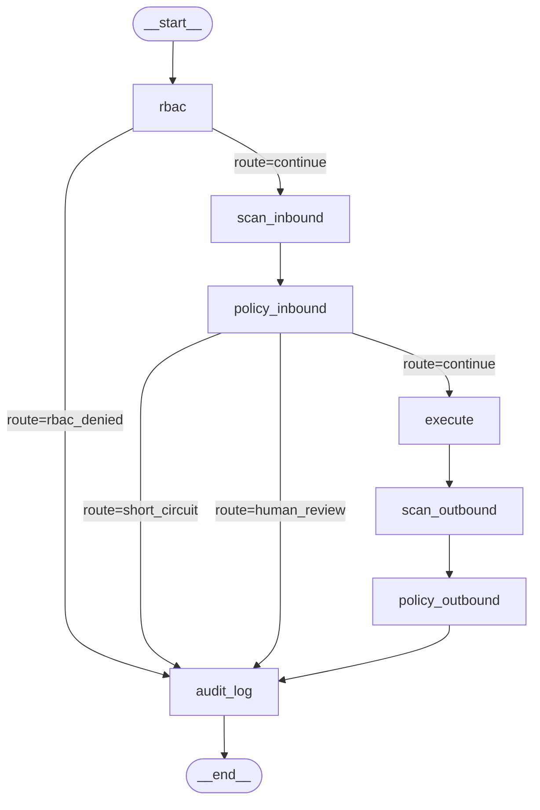

# LangGraph Orchestration Backend

This document describes the LangGraph implementation of the auditguard-mcp pipeline orchestration layer. The async and Temporal backends remain unchanged; this is a third selectable backend.

---

## Why LangGraph

| Concern | LangGraph | async | Temporal |
|---|---|---|---|
| Branching logic | Explicit graph edges | Imperative if-else | Workflow signals |
| Observability | Node-level event stream | No built-in | Event history |
| Durability | None (same as async) | None | Cross-process, durable |
| Operational complexity | Zero (in-process) | Zero | Temporal cluster required |
| Future checkpointing | Drop-in `SqliteSaver` / `PostgresSaver` | Major refactor | Already durable |

Choose LangGraph when you want transparent routing and future extensibility (streaming, tracing via LangSmith, or durable replay via a checkpointer) without the operational cost of a Temporal cluster.

---

## Configuration

```bash
export AUDITGUARD_BACKEND=langgraph   # or: async (default), temporal
```

Or in code:
```python
from auditguard_mcp.config import set_config, get_config
set_config(get_config().model_copy(update={"backend": "langgraph"}))
```

---

## Graph Topology



All short-circuit paths converge on `audit_log`, guaranteeing a structured audit record regardless of where the pipeline exits.

---

## State Schema

`PipelineState` is a `TypedDict` threaded through every node. Nodes return partial dicts; LangGraph merges updates by key overwrite.

| Field | Type | Set by |
|---|---|---|
| `request` | `AuditRequest` | caller |
| `context` | `AuditContext` | caller |
| `decisions` | `list[PipelineDecision]` | `policy_inbound`, `policy_outbound` |
| `inbound_pii` | `PIIScanResult \| None` | `scan_inbound` |
| `outbound_pii` | `PIIScanResult \| None` | `scan_outbound` |
| `inbound_detections` | `list[PIIDetection] \| None` | `scan_inbound` |
| `outbound_detections` | `list[PIIDetection] \| None` | `scan_outbound` |
| `output` | `str \| None` | `execute`, `policy_outbound` (on BLOCK) |
| `status` | `RequestStatus` | `rbac`, `policy_inbound`, `policy_outbound` |
| `error` | `str \| None` | `rbac`, `policy_inbound` |
| `start_time` | `float` | caller (monotonic) |
| `route` | `str` | `rbac`, `policy_inbound` |
| `log_entry` | `PipelineLogEntry \| None` | `audit_log` |

**Mutation contract:** only the node listed in _Set by_ writes each field. `decisions` is overwritten with the full updated list (not appended in-place) to keep state serializable.

---

## Node-by-Node Mapping

| Node | Stage | `stages.py` function | Notes |
|---|---|---|---|
| `rbac` | 1 | `check_rbac` | Catches `RBACDenied`; sets `route=rbac_denied` |
| `scan_inbound` | 2 | `scan_inbound_pii` | CPU-bound; run via `asyncio.to_thread` |
| `policy_inbound` | 3 | `apply_inbound_policy` | Sets `route` for conditional edge |
| `execute` | 4 | `execute_bounded` | Async; enforces timeout via `asyncio.wait_for` |
| `scan_outbound` | 5 | `scan_outbound_pii` | CPU-bound; run via `asyncio.to_thread` |
| `policy_outbound` | 6 | `apply_outbound_policy` | Overwrites `output` on BLOCK |
| `audit_log` | 7 | `write_audit_log` | Terminal node; always runs; writes JSONL |

All nodes are `async def`. Synchronous stage functions are dispatched with `asyncio.to_thread`.

---

## Branching Rules

| After node | `route` value | Next node | `status` set |
|---|---|---|---|
| `rbac` | `continue` | `scan_inbound` | — |
| `rbac` | `rbac_denied` | `audit_log` | `RBAC_DENIED` |
| `policy_inbound` | `continue` | `execute` | — |
| `policy_inbound` | `short_circuit` | `audit_log` | `BLOCKED` |
| `policy_inbound` | `human_review` | `audit_log` | `REVIEW_QUEUED` |
| `policy_outbound` | _(no routing)_ | `audit_log` | `BLOCKED` if action is BLOCK/DENY |

`policy_outbound` has no conditional edge — it always proceeds to `audit_log` and updates `status` and `output` inline when needed.

---

## Error Handling

The public entrypoint `run_audit_pipeline_langgraph` runs the graph via `astream(stream_mode="values")` rather than `ainvoke`, updating `last_state` after each node snapshot. If any node raises an unexpected exception:

1. `last_state` holds the accumulated decisions and detections up to the failing node.
2. The except block calls `write_audit_log` directly using `last_state`, preserving partial audit trail.
3. `status` is set to `ERROR`; `final_action` reflects whatever decisions were completed.

This matches the async backend's error-path behaviour and avoids the data-loss risk of using the empty `initial_state` in the handler.

---

## Tradeoffs vs Other Backends

**vs async backend**
- Extra dependencies: `langgraph`, `langchain-core` (already in core deps for agent examples).
- Small overhead: graph compilation (~0ms, done once at import) and per-call state dict allocation (~1-2ms).
- Same durability guarantee: in-process only; no persistence across crashes.
- Benefit: routing is inspectable via `_PIPELINE_GRAPH.get_graph()` and streamable for external observers.

**vs Temporal backend**
- No cross-process durability: if the worker dies mid-pipeline, the request is lost (same as async).
- No durable human-in-the-loop: `HUMAN_REVIEW` short-circuits immediately instead of waiting on a signal.
- No per-stage retry policies.
- Future path: wire a [LangGraph checkpointer](https://langchain-ai.github.io/langgraph/concepts/persistence/) (`SqliteSaver`, `PostgresSaver`) to gain cross-process persistence without restructuring the graph.

---

## Running the Demo

```bash
# Fast demo (mock PII detector, no model download)
uv run python examples/run_langgraph_backend.py
```

---

## Running Tests

```bash
uv run pytest tests/test_langgraph_runner.py -v

# Regression check -- stages.py is shared; confirm other backends unaffected
uv run pytest tests/test_async_runner.py tests/test_pipeline_stages.py -v
```
